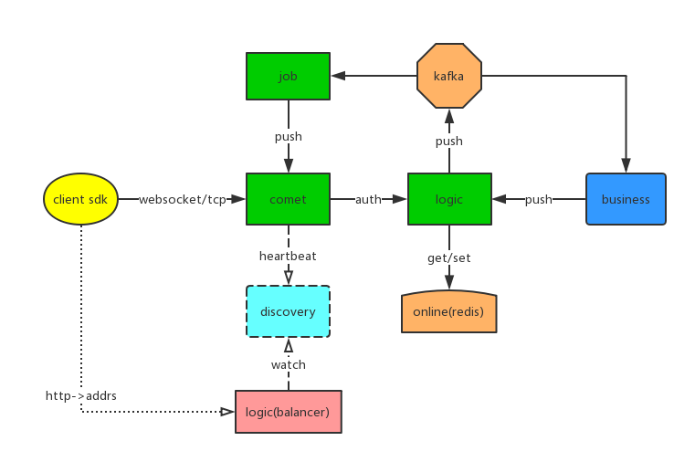

goim v2.0
==============
`Terry-Mao/goim` 是一个支持集群的im及实时推送服务。

---------------------------------------
  * [特性](#特性)
  * [安装](#安装)
  * [配置](#配置)
  * [例子](#例子)
  * [文档](#文档)
  * [集群](#集群)
  * [更多](#更多)

---------------------------------------

## 特性
 * 轻量级
 * 高性能
 * 纯Golang实现
 * 支持单个、多个、单房间以及广播消息推送
 * 支持单个Key多个订阅者（可限制订阅者最大人数）
 * 心跳支持（应用心跳和tcp、keepalive）
 * 支持安全验证（未授权用户不能订阅）
 * 多协议支持（websocket，tcp）
 * 可拓扑的架构（job、logic模块可动态无限扩展）
 * 基于Kafka做异步消息推送

## Architecture


## Quick Start

### Dependencies
+ [Discovery](https://github.com/Bilibili/discovery)
```shell script
# 下载release包
mkdir discovery
tar -zxvf discovery_1.1.2_Linux_x86_64.tar.gz
# 修改地址为0.0.0.0
nohup ./discovery -conf configs/discovery-example.toml &
```
+ [Kafka](https://kafka.apache.org/quickstart)
```shell script
# 下载安装包
http://kafka.apache.org/downloads

# 修改配置server.properties

# 启动服务
nohup ./kafka-server-start.sh ../config/server.properties &
```

#### 组件功能划分
+ Zookeeper 支持Kafka的运行
+ Kafka 消息队列启动，业务Push消息到这里
+ Redis 用户在线状态、服务状态的缓存服务启动
+ Discovery 启动服务注册、发现框架
+ logic启动，接收业务Push消息，推送到消息队列
+ comet启动，接受用户注册、连接注册、消息下发
+ job启动，读取消息队列，发送到comet

### Build
```
    make build
```

### Run
```
    make run
    make stop

    // or
    nohup target/logic -conf=target/logic.toml -region=sh -zone=sh001 deploy.env=dev weight=10 2>&1 > target/logic.log &
    nohup target/comet -conf=target/comet.toml -region=sh -zone=sh001 deploy.env=dev weight=10 addrs=127.0.0.1 2>&1 > target/logic.log &
    nohup target/job -conf=target/job.toml -region=sh -zone=sh001 deploy.env=dev 2>&1 > target/logic.log &

```
### Environment
```
    env:
    export REGION=sh
    export ZONE=sh001
    export DEPLOY_ENV=dev

    supervisor:
    environment=REGION=sh,ZONE=sh001,DEPLOY_ENV=dev

    go flag:
    -region=sh -zone=sh001 deploy.env=dev
```
### Configuration
You can view the comments in target/comet.toml,logic.toml,job.toml to understand the meaning of the config.


## Document
[Protocol](./docs/protocol.png)

[English](./README_en.md)

[中文](./README_cn.md)

## Examples
Websocket: [Websocket Client Demo](https://github.com/Terry-Mao/goim/tree/master/examples/javascript)

Android: [Android](https://github.com/roamdy/goim-sdk)

iOS: [iOS](https://github.com/roamdy/goim-oc-sdk)

## Benchmark


### Benchmark Server
| CPU | Memory | OS | Instance |
| :---- | :---- | :---- | :---- |
| Intel(R) Xeon(R) CPU E5-2630 v2 @ 2.60GHz  | DDR3 32GB | Debian GNU/Linux 8 | 1 |

### Benchmark Case
* Online: 1,000,000
* Duration: 15min
* Push Speed: 40/s (broadcast room)
* Push Message: {"test":1}
* Received calc mode: 1s per times, total 30 times

### Benchmark Resource
* CPU: 2000%~2300%
* Memory: 14GB
* GC Pause: 504ms
* Network: Incoming(450MBit/s), Outgoing(4.39GBit/s)

### Benchmark Result
* Received: 35,900,000/s

[中文](./docs/benchmark_cn.md)

[English](./docs/benchmark_en.md)

## LICENSE
goim is is distributed under the terms of the MIT License.
