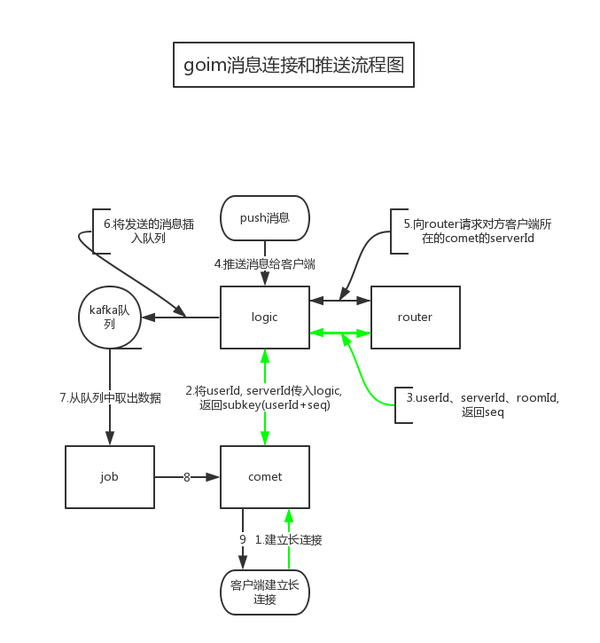

## GOIM快速入门

### 整体架构


### 功能简介

#### 1.comet
```text
长连接服务器，支持长轮训、tcp、websocket连接，有超时机制
```

#### 2.logic
```text
逻辑处理服务器，消息推送入口，
通过userId在router服务器中查找对应的comet服务器，将serverId和消息一起保存到kafka队列，logic是无状态服务器，可以随意增删，
因为comet需要连接logic，所以在comet服务器中需要连接logic的通过LVS的虚IP，LVS加了real server后不会断开，所以需要在comet服务触发SIGHUP，重新load配置文件。
```


3.router
```text
路由服务器，保存userId和serverId的关系，serverId指的是comet服务器地址，userId和roomId的关系，注册用户roomId为固定1，非注册用户roomId为-1，注册和非注册的区分是我猜的，猎豹IM的同学可以确认下。logic连接router需要一致性hash，所以不能随意添加router服务器。不选择redis代替router作者解释是因为有同一userId多次连接序号分配问题以及原子操作，我觉得通过key:userId来记录自增，key:userId:seq来记录每个连接，这样也是可以的。
```


4.job
```text
消息转发服务器，从kafka队列中获取消息，发送给comet服务器，无状态服务器可以随意增删。
```

### 推送服务具有的特性
+ 1.支持一个端的多个连接，比如同一用户在不同的电脑上登录可以同时接收到消息；
+ 2.不支持客户端的区分（pc/wap/ios/android）
+ 3.目前没有查询某个用户是否在线，某些业务上有显示在线状态的需求，这个可以在logic服务器中添加一个接口；发送消息时如果不在线可能会通过其他推送服务（如信鸽推送），这个可以通过修改push接口的返回值来判断
+ 4.群发只能是在线才能收到，如果不在线就丢弃此消息，当然用户可以下次登录时再通过未读消息接口获取
+ 5.在长连接的时候comet->logic->router，而不是comet->router，这样是为了可以在逻辑服务器中获取其他用户状态、未读消息等，这样确实使得comet简单了，且不会有一致性问题。
+ 6.支持群发功能，所有用户或按照roomId来群发，这个功能太爽了，效率不是提高一点半点。


### 问题解决
+ 连接数如何分配 ？
+ 数据如何在多个节点之间转发 ？
+ 节点异常恢复 ？

### 参考资料
+  [《goim架构分析》](https://www.jankl.com/info/goim%20%E6%9E%B6%E6%9E%84%E5%88%86%E6%9E%90)
+ [《goim源码剖析》](https://www.jianshu.com/p/aa8be29397ec)