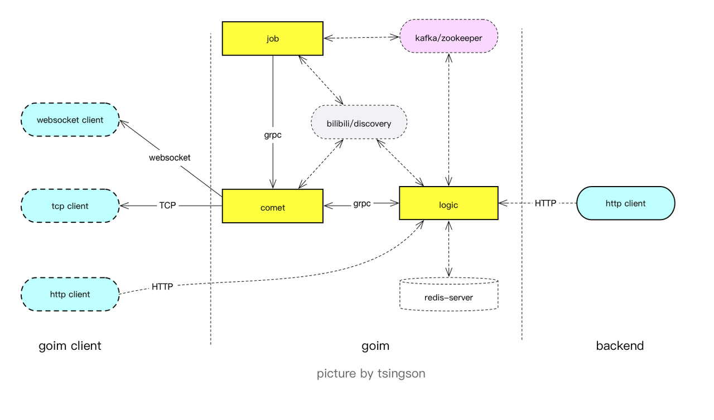
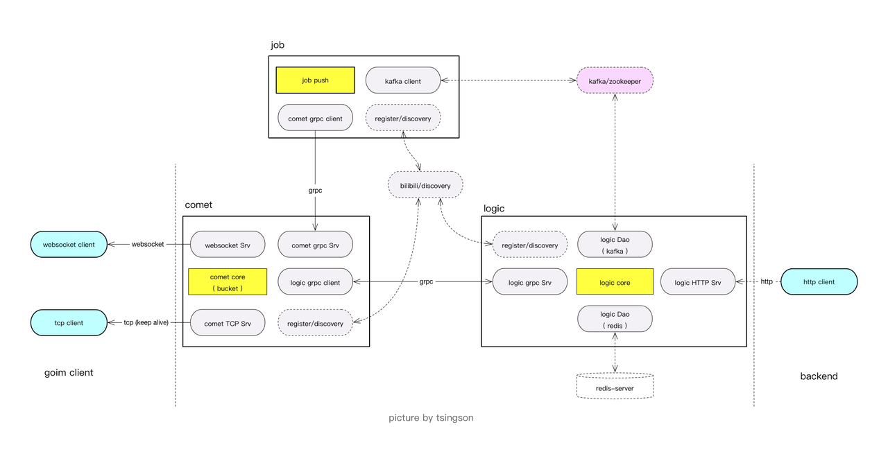

## GOIM快速入门

### 整体架构(2.0版本)

+ Comet负责建立和维持客户端的长连接。
+ Job负责消息的分发。
+ Logic提供三种纬度的消息（全局，ROOM，用户）投递，还包括业务逻辑，Session管理。

#### 组件功能划分
+ Zookeeper 支持Kafka的运行
+ Kafka 消息队列启动，业务Push消息到这里
+ Redis **用户在线状态、服务状态**的缓存服务启动
+ Discovery 启动服务注册、发现框架
+ logic启动，**接收业务Push消息，推送到消息队列**
+ comet启动，接受**用户注册、连接注册、消息下发**
+ job启动，**读取消息队列，发送到comet**
+ comet / job / logic 支持多实例部署。 同时, push message 消息发布接口从 comet 拆分也有一定的考量, 毕竟多数IM 尤其是 bilibili 的业务场景上来说, 发送量少, 而阅读量多。

### 架构细节(内部逻辑组件与接口关系)

#### 数据流转
+ http 接口向 logic 发送数据
+ logic 从 redis 中获取会话数据( mid –> server 与 room–>server 的对应关系), 以 protobuf 序列化数据, 发送到 MQ
+ job 从 MQ 中订阅数据, 取出 im 发送数据中的 server / room 向指定 server 的 comet 发送数据
+ comet 接收 job 分发的数据后, 存入 指定 channel 的 ring buffer , 再转为 tcp/websocket 数据包, 发送到指定 channel 的客户端

### 问题解决
+ 连接数如何分配 ？
    + 连接到Comet，然后通过commet和logic之间的grpc heartbeat命令给logic信息
+ 多个Comet和多个Logic怎么交互？
    + Logic会获取全部的Comet消息，并且关注Comet变化
    + 
+ 多个Job和多个Comet如果对应
    
+ 数据如何在多个节点之间转发 ？
+ 节点异常恢复 ？

### 参考资料
+ [《goim 架构与定制》](https://juejin.im/post/5cbb9e68e51d456e51614aab)
+ [《goim 中的 data flow 数据流转及优化思考》](https://tsingson.github.io/tech/goim-go-04/)
+  [《goim架构分析》](https://www.jankl.com/info/goim%20%E6%9E%B6%E6%9E%84%E5%88%86%E6%9E%90)
+ [《goim源码剖析》](https://www.jianshu.com/p/aa8be29397ec)
+ [《消息推送架构-Based-GOIM》](https://zhuanlan.zhihu.com/p/128941542)